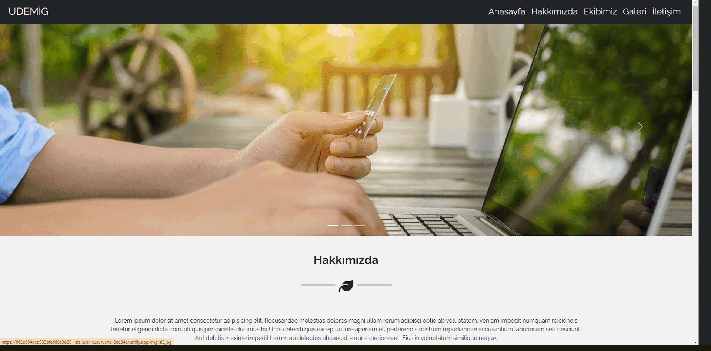

# Website

A responsive website developed using Bootstrap.

## Technologies Used

- HTML
- CSS
- Bootstrap

## GIF



## Link

[Visit the Website](https://662e904dcd933bfa680a3d90--stellular-cucurucho-8de34c.netlify.app/)

## Description

This project is a responsive website created using HTML, CSS, and Bootstrap. It features a modern and flexible design, providing an excellent user experience across various devices.

## Features

- **Responsive Design:** The website is fully responsive and works well on all devices.
- **Modern Layout:** Simple and modern layout for a professional look.
- **Flexible and User-Friendly:** Engaging design to enhance user experience.

## How to Use

1. Clone the repository:
   ```bash
   git clone https://github.com/yourusername/bootstrap-website.git
   Open the index.html file in your browser to view the website.
   Contribution
   Feel free to contribute to this project by creating a pull request. For major changes, please open an issue first to discuss what you would like to change.
   ```

License
This project is open source and available under the MIT License.
